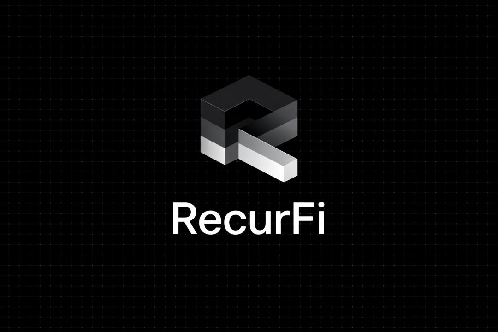

# RecurFi — Smart DCA Agent (Onchain)

> Fully onchain dollar-cost averaging — autonomous, transparent, verifiable.  
> Built on **X Layer** with **OKX Onchain OS** & **Uniswap** routing.



---

## 🧠 Project Introduction

**RecurFi** is an autonomous DCA (Dollar-Cost Averaging) agent that lives entirely onchain. Users deposit tokens into a vault, configure a strategy (token pair, amount per execution, interval), and anyone can trigger the `executeDCA()` function — making it a truly permissionless, verifiable, and autonomous agent.

The agent uses the **OKX DEX Aggregator API** (an Onchain OS skill) to find the best swap route across liquidity sources on X Layer, including **Uniswap** pools, then executes the swap through the DCAAgent smart contract vault.

### Why RecurFi?

- **Fully onchain**: No backend cron jobs. The execution function is public and permissionless.
- **Agent-first**: The smart contract IS the agent — it holds assets, follows rules, and executes autonomously.
- **Best execution**: Uses OKX DEX aggregation to route through Uniswap and other DEXes for optimal pricing.
- **Transparent**: Every execution emits events; full history is verifiable onchain.

---

## 🏗 Architecture Overview

```
┌─────────────────────────────────────────────────────┐
│                    Frontend (Next.js)                │
│  Dashboard │ Strategy │ Execute │ History            │
│  wagmi + viem + RainbowKit                          │
└──────────────┬──────────────────┬───────────────────┘
               │                  │
               │ Contract Reads   │ /api/dex (OKX API)
               │ (wagmi hooks)    │ (server-side signing)
               ▼                  ▼
┌──────────────────────┐  ┌──────────────────────────┐
│   DCAAgent.sol       │  │  OKX Onchain OS          │
│   (X Layer)          │  │  DEX Aggregator API      │
│                      │  │  → Uniswap routing       │
│  • deposit()         │  │  → Best price discovery   │
│  • setStrategy()     │  │  → Swap calldata          │
│  • executeDCA()  ◄───┼──┤                          │
│  • withdraw()        │  └──────────────────────────┘
│  • canExecute()      │
└──────────────────────┘
```

### Components

| Component | Description |
|-----------|-------------|
| **DCAAgent.sol** | Core vault contract — holds deposits, stores strategies, executes swaps via router |
| **Next.js Frontend** | Dashboard, strategy setup, execute trigger, tx history |
| **API Route `/api/dex`** | Server-side OKX API signing — fetches swap calldata securely |
| **OKX Onchain OS** | DEX aggregator skill for best-route swap execution on X Layer |

---

## 📦 Deployment Addresses

| Contract | Address | Network |
|----------|---------|---------|
| DCAAgent | `<DEPLOYED_ADDRESS>` | X Layer (196) |
| MockUSDC | `<DEPLOYED_ADDRESS>` | X Layer (196) |
| Swap Router | `0x40aA958dd87FC8305b97f2BA922CDdCa374bcD7f` | X Layer (196) |

> Agentic Wallet: The DCAAgent contract itself acts as the project's Agentic Wallet — it holds user funds, signs approvals to the DEX router, and executes swaps autonomously.

---

## 🔧 Onchain OS / Uniswap Skill Usage

### OKX Onchain OS Skills Used:

1. **okx-dex-swap** — Core skill. Used to get optimal swap calldata for DCA executions. The API route `/api/dex` calls the OKX DEX Aggregator API (`/api/v6/dex/aggregator/swap`) to fetch transaction data that the DCAAgent contract uses to execute swaps on X Layer.

2. **okx-dex-market** — Used for displaying token pricing and market data in the frontend dashboard.

3. **Agentic Wallet** — The DCAAgent smart contract serves as the project's Agentic Wallet. It:
   - Holds user assets securely
   - Approves and routes swaps via the OKX DEX router
   - Operates autonomously based on user-configured rules

### Uniswap Integration:

The OKX DEX Aggregator routes swaps through **Uniswap V3 pools** deployed on X Layer as part of its liquidity aggregation. The `exactInputSingle` pattern is used for token swaps, with the aggregator finding the best route (which may include Uniswap pools among other DEX sources).

---

## ⚙️ Working Mechanics

### User Flow:
1. **Connect Wallet** → RainbowKit connects to X Layer
2. **Deposit** → User deposits USDC into the DCAAgent vault
3. **Set Strategy** → Choose target token (ETH/WBTC/OKB), amount per execution, interval
4. **Execute** → Anyone can call `executeDCA()` when the cooldown has passed
5. **View History** → All executions are logged as onchain events

### Agent Logic:
```
executeDCA(user, swapCalldata):
  1. Verify strategy is active
  2. Check cooldown: block.timestamp >= lastExecution + interval
  3. Check balance: vault balance >= amountPerExec
  4. Deduct from user vault balance
  5. Approve DEX router to spend tokens
  6. Execute swap via router with calldata from OKX DEX API
  7. Credit user with received tokens
  8. Update lastExecution timestamp
  9. Emit DCAExecuted event
```

---

## 👥 Team

| Member | Role |
|--------|------|
| 0xnald | Full-stack developer |

---

## 🌐 X Layer Ecosystem Positioning

RecurFi fills a gap in the X Layer DeFi ecosystem by providing **automated investment infrastructure**. While X Layer has DEXes, lending protocols, and bridges, there is no native DCA solution. RecurFi:

- Brings passive investment strategies to X Layer users
- Drives recurring swap volume through X Layer DEXes
- Demonstrates the power of OKX Onchain OS skills for building autonomous agents
- Creates a composable primitive that other protocols can build on

---

## 🚀 Quick Start

### Prerequisites
- Node.js 18+
- OKX Developer API keys ([Get them here](https://web3.okx.com/onchainos/dev-docs/home/developer-portal))
- OKB for gas on X Layer

### Install & Run

```bash
# Clone
git clone https://github.com/0xnald/recurfi-smart-dca-agent.git
cd recurfi-smart-dca-agent

# Install
npm install

# Copy env
cp .env.example .env
# Fill in your keys in .env

# Compile contracts
npx hardhat compile

# Run tests
npx hardhat test

# Deploy to X Layer
npx hardhat run scripts/deploy.ts --network xlayer

# After deploying, update .env with contract address:
# NEXT_PUBLIC_DCA_AGENT_ADDRESS=0x...

# Run frontend
npm run dev
```

### Deploy to Vercel

```bash
# Push to GitHub
git add .
git commit -m "RecurFi v1.0 - Smart DCA Agent"
git push origin main

# Deploy via Vercel CLI
npx vercel --prod

# Or connect your GitHub repo at vercel.com
# Set environment variables in Vercel dashboard
```

---

## 📄 License

MIT
